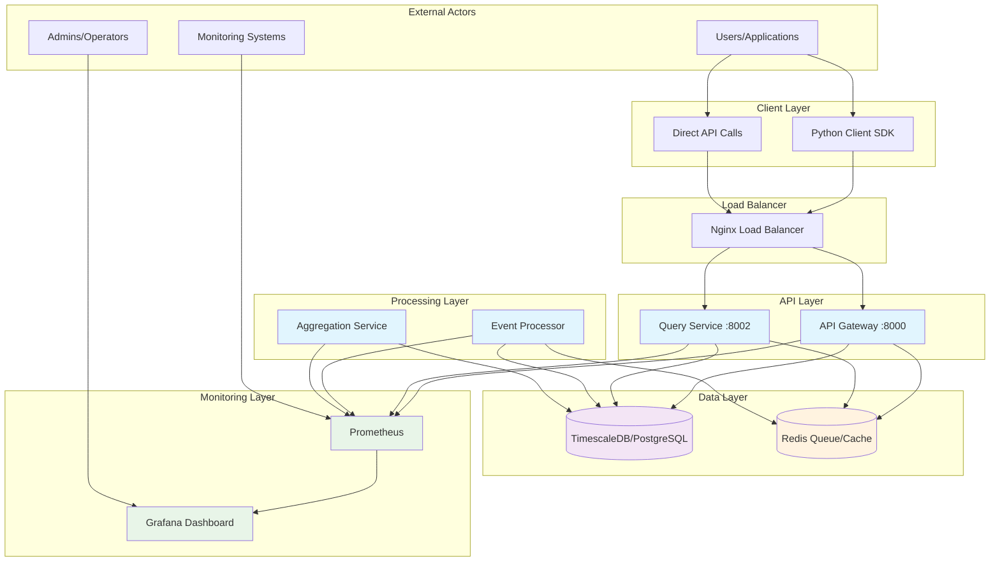
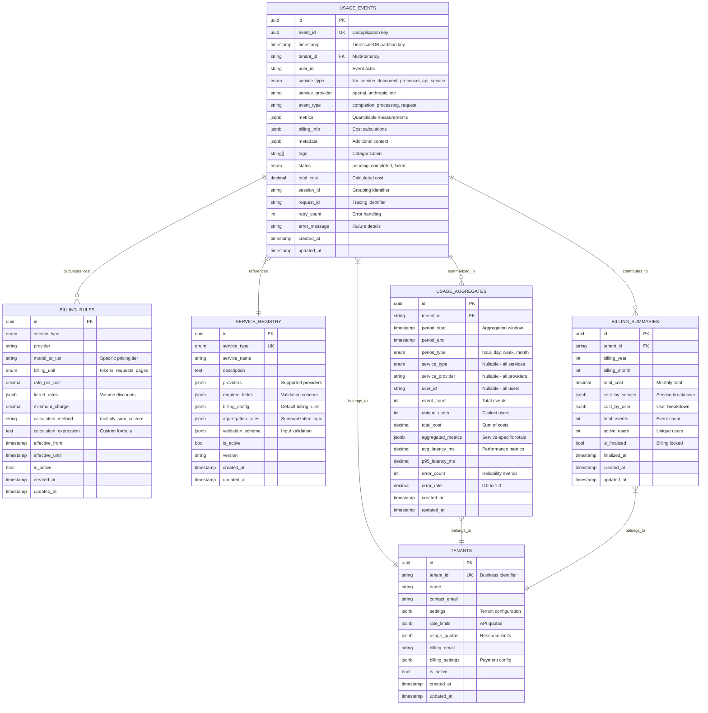
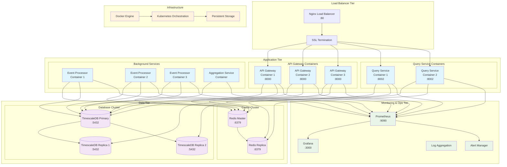
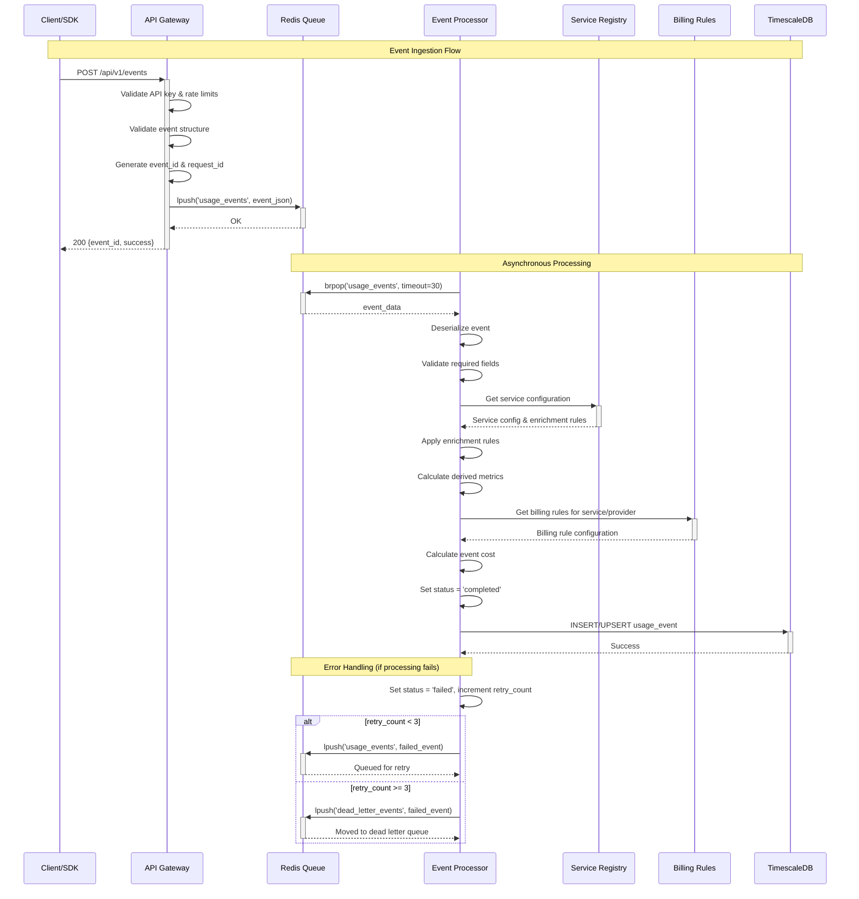
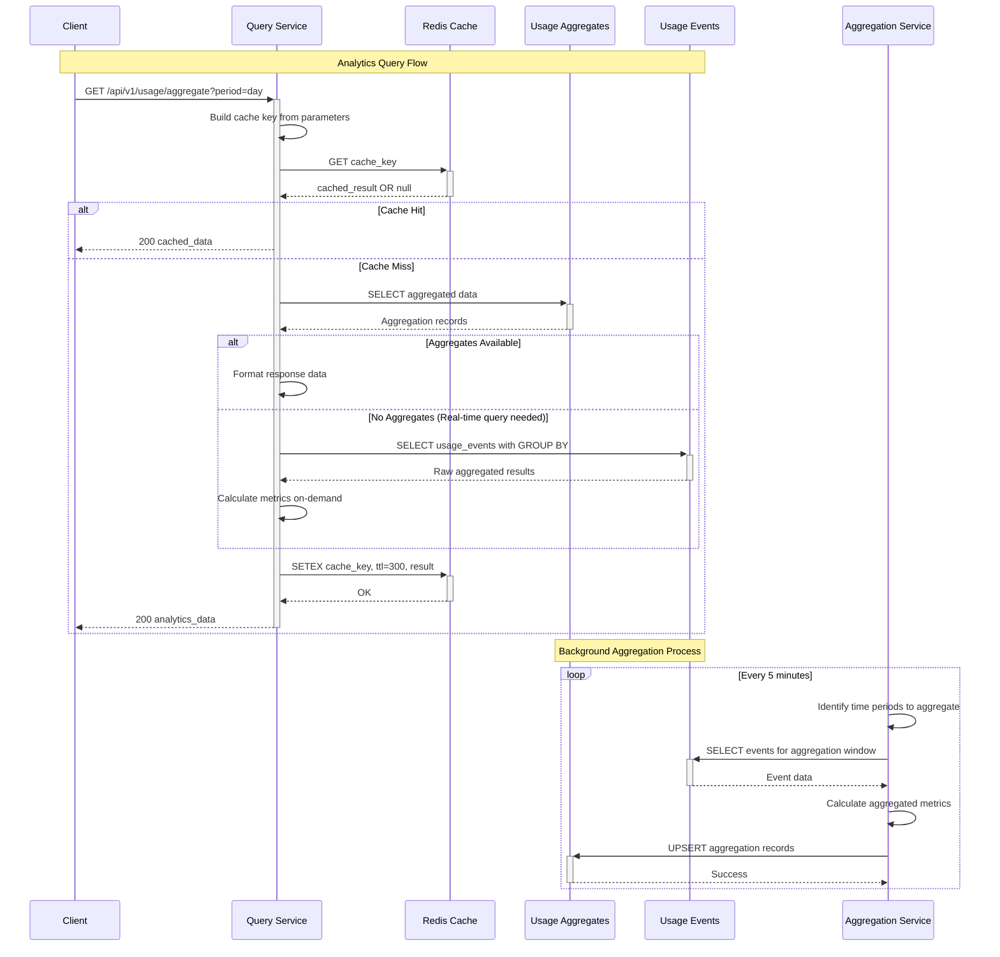

# Usage Tracking System - Architecture Documentation

## System Overview

The Usage Tracking System is a production-ready, multi-tenant SaaS platform designed to track, process, and analyze usage events from various service types including LLMs, document processors, and APIs. The system follows a microservices architecture with event-driven processing and real-time analytics capabilities.

## 1. High-Level System Architecture

### Purpose
Shows the overall system context, external actors, and major system boundaries.

### Diagram


### Components
- **Python Client SDK**: Easy-to-use SDK for applications to track usage events
- **API Gateway**: Main entry point for event ingestion and basic queries  
- **Query Service**: Dedicated service for complex analytics and data retrieval
- **Event Processor**: Async service processing events from Redis queue
- **Aggregation Service**: Background service generating pre-computed summaries
- **TimescaleDB**: Time-series optimized PostgreSQL for efficient data storage
- **Redis**: Message queue for event processing and result caching
- **Nginx**: Load balancer for production deployments

### Key Data Flows
- **Event Ingestion**: SDK/API → API Gateway → Redis Queue → Event Processor → Database
- **Query Flow**: Client → Query Service → Database/Cache → Response
- **Aggregation Flow**: Aggregation Service → Database (reads/writes summaries)
- **Monitoring**: All services → Prometheus → Grafana

## 2. Service/Component Architecture

### Purpose
Detailed view of all services, their interactions, and internal APIs.

### Diagram
```mermaid
graph TB
    subgraph "Client SDK Layer"
        SDK[UsageTracker SDK]
        SDK_METHODS[track_llm()<br/>track_document()<br/>track_api()<br/>track_custom()<br/>get_usage()]
        SDK --> SDK_METHODS
    end
    
    subgraph "API Gateway Service"
        AG_MAIN[API Gateway Main]
        AG_AUTH[Auth Middleware]
        AG_RATE[Rate Limit Middleware] 
        AG_ENDPOINTS["/api/v1/events"<br/>"/api/v1/events/batch"<br/>"/api/v1/usage"<br/>"/health"]
        
        AG_MAIN --> AG_AUTH
        AG_AUTH --> AG_RATE
        AG_RATE --> AG_ENDPOINTS
    end
    
    subgraph "Event Processor Service"
        EP_MAIN[Event Processor]
        EP_QUEUE[Queue Consumer]
        EP_ENRICHER[Event Enricher]
        EP_BILLING[Billing Calculator]
        EP_VALIDATOR[Data Validator]
        
        EP_MAIN --> EP_QUEUE
        EP_QUEUE --> EP_VALIDATOR
        EP_VALIDATOR --> EP_ENRICHER
        EP_ENRICHER --> EP_BILLING
    end
    
    subgraph "Query Service"
        QS_MAIN[Query Service Main]
        QS_ENDPOINTS["/api/v1/usage"<br/>"/api/v1/usage/aggregate"<br/>"/api/v1/usage/by-service"<br/>"/api/v1/usage/costs"<br/>"/api/v1/analytics/trends"]
        QS_CACHE[Result Caching]
        
        QS_MAIN --> QS_ENDPOINTS
        QS_MAIN --> QS_CACHE
    end
    
    subgraph "Aggregation Service"
        AS_MAIN[Aggregation Service]
        AS_SCHEDULER[Aggregation Scheduler]
        AS_HOURLY[Hourly Aggregator]
        AS_DAILY[Daily Aggregator] 
        AS_MONTHLY[Monthly Aggregator]
        AS_BILLING[Billing Summarizer]
        
        AS_MAIN --> AS_SCHEDULER
        AS_SCHEDULER --> AS_HOURLY
        AS_SCHEDULER --> AS_DAILY
        AS_SCHEDULER --> AS_MONTHLY
        AS_SCHEDULER --> AS_BILLING
    end
    
    subgraph "Shared Components"
        MODELS[Data Models<br/>UsageEvent<br/>ServiceRegistry<br/>BillingRule<br/>UsageAggregate]
        REPOS[Repository Layer<br/>UsageEventRepository<br/>ServiceRegistryRepository<br/>BillingRuleRepository]
        UTILS[Shared Utilities<br/>Logging<br/>Validation<br/>Billing Calculation]
        
        MODELS --> REPOS
        REPOS --> UTILS
    end
    
    subgraph "External Dependencies"
        PG[(TimescaleDB)]
        REDIS[(Redis)]
        PROM[Prometheus Metrics]
    end
    
    %% Client to API Gateway
    SDK_METHODS --> AG_ENDPOINTS
    
    %% API Gateway to Redis
    AG_ENDPOINTS --> REDIS
    AG_ENDPOINTS --> PG
    
    %% Event Processing Flow
    REDIS --> EP_QUEUE
    EP_BILLING --> PG
    
    %% Query Service connections
    QS_ENDPOINTS --> PG
    QS_CACHE --> REDIS
    
    %% Aggregation Service
    AS_BILLING --> PG
    
    %% Shared components usage
    EP_MAIN --> REPOS
    QS_MAIN --> REPOS
    AS_MAIN --> REPOS
    AG_MAIN --> REPOS
    
    %% Monitoring
    AG_MAIN --> PROM
    EP_MAIN --> PROM
    QS_MAIN --> PROM
    AS_MAIN --> PROM
    
    %% Styling
    classDef service fill:#e1f5fe
    classDef middleware fill:#fff9c4
    classDef database fill:#f3e5f5
    classDef shared fill:#f0f4ff
    
    class AG_MAIN,EP_MAIN,QS_MAIN,AS_MAIN service
    class AG_AUTH,AG_RATE middleware  
    class PG,REDIS database
    class MODELS,REPOS,UTILS shared
```

### Key Service Responsibilities

**API Gateway Service:**
- Event ingestion (single and batch)
- Request authentication and authorization
- Rate limiting and quota enforcement
- Basic usage queries
- Health monitoring

**Event Processor Service:**
- Asynchronous event processing from Redis queue
- Event validation and enrichment
- Billing cost calculation
- Service registry lookups
- Dead letter queue handling for failed events

**Query Service:**
- Complex analytics queries
- Pre-aggregated data retrieval
- Cost analysis and breakdowns
- Trend analysis and forecasting
- Result caching for performance

**Aggregation Service:**
- Scheduled data aggregation (hourly/daily/monthly)
- Billing summary generation
- Performance metric calculations
- Multi-dimensional rollups (tenant, service, user)

## 3. Data Architecture

### Purpose
Shows database schemas, data flow, and relationships between data stores.

### Diagram


### Data Stores and Their Purposes

**TimescaleDB/PostgreSQL (Primary Database):**
- **usage_events**: Main event storage with time-based partitioning
- **usage_aggregates**: Pre-computed summaries for fast querying
- **billing_summaries**: Monthly billing rollups for invoicing
- **service_registry**: Service definitions and configurations
- **billing_rules**: Pricing rules and cost calculation logic
- **tenants**: Multi-tenant configuration and settings

**Redis (Cache and Queue):**
- **Event Queue**: `usage_events` list for async processing
- **Dead Letter Queue**: `dead_letter_events` for failed events  
- **Query Cache**: `query_cache:*` keys for API response caching
- **Rate Limiting**: Token bucket counters per tenant
- **Session Storage**: Temporary state for batch processing

### Key Indexes and Performance Optimizations

**Primary Indexes:**
- TimescaleDB automatic time-based partitioning on `timestamp`
- Composite indexes on `(tenant_id, timestamp)` for tenant queries
- Service-based indexes on `(service_type, timestamp)`
- User-based indexes on `(user_id, timestamp)`

**JSON Indexes:**
- GIN indexes on JSONB columns (`metadata`, `metrics`, `billing_info`)
- Partial indexes on status for efficient error handling

**Aggregation Optimizations:**
- Unique constraints preventing duplicate aggregations
- Multi-dimensional rollup strategies (tenant → service → user)

## 4. Deployment Architecture

### Purpose
Shows infrastructure components, containerization, and production deployment.

### Diagram


### Deployment Configuration

**Container Orchestration:**
- Docker containers with multi-stage builds
- Kubernetes for production orchestration
- Horizontal Pod Autoscaling based on CPU/memory
- Service mesh for inter-service communication

**Resource Allocation:**
- API Gateway: 512MB RAM, 0.5 CPU per container
- Query Service: 512MB RAM, 0.5 CPU per container  
- Event Processor: 512MB RAM, 0.5 CPU per container
- Aggregation Service: 512MB RAM, 0.5 CPU (single instance)

**High Availability:**
- Multiple replicas for stateless services
- Database clustering with read replicas
- Redis replication for cache reliability
- Health checks and automatic failover

**Networking:**
- Private network (172.20.0.0/16) for service communication
- Load balancer with SSL termination
- Service discovery via Kubernetes DNS
- Network policies for security isolation

## 5. Event Processing Flow Sequence

### Purpose
Detailed sequence diagram showing how events flow through the system from ingestion to storage.

### Diagram


## 6. Query and Analytics Flow

### Purpose
Shows how analytical queries are processed and cached.

### Diagram


## 7. Technology Stack Summary

### Core Technologies
- **Language**: Python 3.11+
- **Web Framework**: FastAPI (async/await support)
- **Database**: PostgreSQL 14 with TimescaleDB extension
- **Cache/Queue**: Redis 7
- **HTTP Client**: httpx (async)
- **ORM**: SQLAlchemy 2.0 with async support

### Infrastructure
- **Containerization**: Docker with multi-stage builds
- **Orchestration**: Docker Compose (dev) / Kubernetes (prod)
- **Load Balancer**: Nginx
- **Monitoring**: Prometheus + Grafana
- **Logging**: Structured logging with structlog

### Development & Testing
- **Testing**: pytest with async support
- **Code Quality**: Black, isort, mypy
- **Database Migrations**: Alembic
- **Environment**: python-dotenv for configuration

## 8. Key Architectural Decisions

### Event-Driven Architecture
- **Decision**: Use Redis queue for async event processing
- **Rationale**: Decouples ingestion from processing, enables horizontal scaling
- **Trade-offs**: Eventual consistency, requires reliable queue management

### Time-Series Database
- **Decision**: PostgreSQL with TimescaleDB for time-series data
- **Rationale**: Optimized for time-based queries, familiar SQL interface
- **Trade-offs**: Single database type vs. polyglot persistence

### Pre-Aggregation Strategy
- **Decision**: Background service for pre-computed summaries
- **Rationale**: Fast query response times for analytical queries
- **Trade-offs**: Storage overhead vs. query performance

### Multi-Tenant Design
- **Decision**: Shared database with tenant isolation
- **Rationale**: Cost efficiency, easier operations
- **Trade-offs**: Shared infrastructure vs. complete isolation

### SDK-First Approach
- **Decision**: Comprehensive client SDK with batching
- **Rationale**: Developer experience, reduced API calls
- **Trade-offs**: SDK complexity vs. direct API usage

## 9. Future Architecture Considerations

### Scalability Improvements
- **Horizontal Partitioning**: Shard by tenant_id for very large scales
- **Read Replicas**: Geographic distribution for global deployments
- **Event Streaming**: Kafka for higher throughput scenarios

### Advanced Analytics
- **Real-time Stream Processing**: Apache Flink for instant aggregations
- **Machine Learning**: Usage prediction and anomaly detection
- **Data Warehouse**: Export to analytical databases for complex BI

### Operational Excellence  
- **Circuit Breakers**: Resilience patterns for service interactions
- **Distributed Tracing**: OpenTelemetry for request tracing
- **Chaos Engineering**: Proactive reliability testing

## 10. Maintenance and Operational Guidelines

### Database Maintenance
- **Partitioning**: Automatic time-based partitioning in TimescaleDB
- **Data Retention**: Configurable event retention policies
- **Index Management**: Regular VACUUM and ANALYZE operations

### Monitoring Alerts
- **SLI/SLO Definition**: 99.9% availability, <100ms p95 latency
- **Key Metrics**: Queue depth, processing lag, error rates
- **Business Metrics**: Event ingestion rate, tenant usage patterns

### Backup and Recovery
- **Database Backups**: Automated daily backups with point-in-time recovery
- **Configuration Backup**: Infrastructure as code approach
- **Disaster Recovery**: Multi-region deployment capabilities

---

*This architecture documentation is living document that should be updated as the system evolves. Last updated: 2025-09-11*